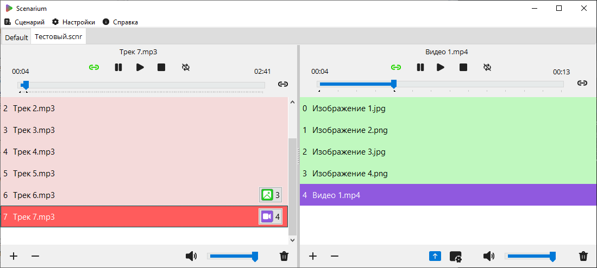

# Scenarium

**Документация** - [Scenarium Wiki](https://github.com/kfilippenok/Scenarium/wiki)

**Scenarium** - программный комплекс для мультимедийного обеспечения концертных мероприятий, который объединяет аудио- и видеоплеер в одно целое, имея возможность связного запуска и управления  воспроизведением аудио, видео или изображений.

Для вывода мультимедиа использовалась библиотека [libmpv](https://github.com/mpv-player/mpv), которая представлена в виде DLL-файла. Для взаимодействия с библиотекой были использованы интерфейсы [LibMPVDelphi](https://github.com/nbuyer/LibMPVDelphi). 

Программный комплекс разработан при помощи среды быстрой интегрированной разработки [Lazarus](https://www.lazarus-ide.org/) (версия 2.2.6).

Изображения использовались из бесплатного набор Fluent Design Icons от Microsoft. Логотип разработан автором проекта - Кириллом Филиппёнком.

Проект реализован в рамках выпускной квалификационной работы на тему «Разработка программного обеспечения для мультимедийного обеспечения концертных мероприятий» по направление подготовки 09.03.01 Информатика и вычислительная техника
(профиль «Программное обеспечение вычислительной техники и автоматизированных систем»).
